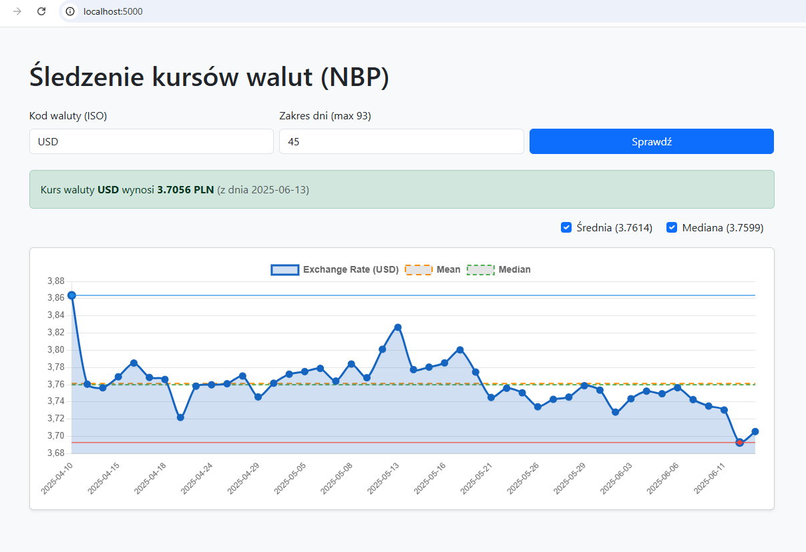

# Currency Rates Viewer (from NBP)
---

<a name="readme-top"></a>
<!-- TABLE OF CONTENTS -->

## 📗 Table of Contents

- [📖 About the Project](#about-project)
  - [🛠 Built With](#built-with)
    - [Tech Stack](#tech-stack)
    - [Key Features](#key-features)
- [🧩 Project Structure](#project-structure)
- [💻 Getting Started](#getting-started)
  - [Setup](#setup)
  - [Install](#install)
- [🚀 Demo](#demo)
- [👥 Author](#author)
- [🔭 Future Features](#future-features)
- [🤝 Contributing](#contributing)
- [⭐️ Show your support](#support)
- [📝 License](#license)
<!-- - [🙏 Acknowledgements](#acknowledgements)-->

<!-- PROJECT DESCRIPTION -->
## 📖 About the Project <a name="about-project"></a>

Simple Flask web application to track and visualize currency exchange rates from the National Bank of Poland (NBP).  
Includes historical data visualization with min, max, mean and median rates.


## 🛠 Built With <a name="built-with"></a>

### Tech Stack <a name="tech-stack"></a>

<details>
  <summary>Backend</summary>
  <ul>
    <li><a href="https://www.python.org/">Phyton</a></li>
    <li><a href="https://palletsprojects.com/projects/flask">Flask</a></li>
    <li><a href="https://requests.readthedocs.io/en/latest/">Requests</a></li>
  </ul>
</details>
<details>
  <summary>Frontend</summary>
  <ul>
    <li><a href="https://www.w3.org/TR/html52/">HTML5</a></li>
    <li><a href="https://www.w3.org/Style/CSS/Overview.en.html">CSS3</a></li>
    <li><a href="https://developer.mozilla.org/en-US/docs/Web/JavaScript">JavaScript</a></li>
    <li><a href="https://www.chartjs.org/">Chart.js</a></li>
    <li><a href="https://getbootstrap.com/docs/5.3/">Bootstrap 5</a></li>
  </ul>
</details>


<!-- Features -->

### Key Features <a name="key-features"></a>

Features:

- Fetch current exchange rate for any currency code (default EUR).  
- Display historical exchange rates for a selectable number of days (up to 93).  
- Interactive chart with min, max, mean and median markers.  
- Responsive and clean UI built with Bootstrap 5.  
- Frontend uses Chart.js for dynamic graphs.

<p align="right">(<a href="#readme-top">back to top</a>)</p>


<!-- PROJECT STRUCTURE -->

## 🧩 Project Structure <a name="project-structure"></a>

```sh
currency-rates-viewer/
│
├── app.py               # Flask backend logic
│
├── static/
│   ├── style.css        # Custom CSS styles
│   └── script.js        # Chart rendering and interactivity
├── templates/
│   └── index.html       # HTML template with Bootstrap and Chart.js
│
├── requirements.txt     # Python dependencies
├── README.md
└── LICENSE
```

<!-- GETTING STARTED -->

## 💻 Getting Started <a name="getting-started"></a>

To get a local copy up and running, follow these steps.

### Setup
Clone this repository to your desired folder:

```sh
  git clone https://github.com/Ko0oB/currency-rates-viewer.git
```
or 
```sh
  git clone git@github.com:Ko0oB/currency-rates-viewer.git
```
Create and activate virtual environment
```sh
  python -m venv venv
    # Windows
  venv\Scripts\activate
    # Linux / macOS
  source venv/bin/activate
```

### Install
Install dependencies:
```sh
  pip install -r requirements.txt
```

### Usage
Run the Flask app:
```sh
  python app.py
```
Open your browser at http://127.0.0.1:5000 or http://localhost:5000/ 

Enter currency code (e.g. EUR, USD) and number of days (default 30, max 93).

View current rate and interactive historical chart with statistical markers.

<p align="right">(<a href="#readme-top">back to top</a>)</p>

<!-- DEMO -->

## 🚀 Demo <a name="demo"></a>



<p align="right">(<a href="#readme-top">back to top</a>)</p>

<!-- AUTHORS -->

## 👥 Authors <a name="author"></a>

👤 **Konrad "KoB"**

- GitHub: [@Ko0oB](https://github.com/Ko0oB)

<p align="right">(<a href="#readme-top">back to top</a>)</p>

<!-- FUTURE FEATURES -->

## 🔭 Future Features <a name="future-features"></a>

- **TBD**

<p align="right">(<a href="#readme-top">back to top</a>)</p>

<!-- CONTRIBUTING -->

## 🤝 Contributing <a name="contributing"></a>

Contributions, issues, and feature requests are welcome!

Feel free to check the [issues page](https://github.com/Ko0oB/Sudoku/issues)

<p align="right">(<a href="#readme-top">back to top</a>)</p>

<!-- SUPPORT -->

## ⭐️ Show your support <a name="support"></a>

Give a ⭐️ if you like this project!

<p align="right">(<a href="#readme-top">back to top</a>)</p>

<!-- ACKNOWLEDGEMENTS -->
<!-- 
## 🙏 Acknowledgments <a name="acknowledgements"></a>

N/A

<p align="right">(<a href="#readme-top">back to top</a>)</p>
-->
<!-- LICENSE -->

## 📝 License <a name="license"></a>

This project is [MIT](./LICENSE) licensed.

<p align="right">(<a href="#readme-top">back to top</a>)</p>
